# UT1.1 Introducción a las interfaces

## Interfaz gráfica de usuario (GUI)

```note
💡 La Interfaz gráfica de usuario o **GUI** (*Graphic User Interface*) es el entorno visual de imágenes y objetos mediante el cual una máquina y un usuario interactúan.
```

Casi todos los programas o apps tienen alguna clase de interfaz visual, que sirve al mismo tiempo para mostrar información al usuario y como un mapa de navegación entre diferentes comandos.

Hay interfaces visuales como las de los smartphones, diseñadas para disminuir al máximo la curva de aprendizaje. También la interfaz de las web está diseñada para que cualquier visitante pueda usarla sin necesidad de conocimientos específico previos.

Existen otras formas de comunicación entre un software y un usuario:

-   **Interfaz de voz** (VUI): Se trata de programas capaces de identificar e interpretar el habla. El ejemplo más claro que tenemos es el reciente auge de las inteligencias artificiales, como Siri, que se controlan por medio de la voz.
-   **Interfaz de texto** (CLI): Se utiliza principalmente en el ámbito de la programación de sistemas operativos y es la evolución de la interfaz de línea de comando primitiva que usaban los primeros programas de computadora.
-   **Interfaz natural**: Se le llama así al tipo de interfaz que identifica e interpreta acciones naturales del ser humano, como movimientos y expresiones faciales. Un ejemplo de ello son interfaces como Kinect o la cámara de PS4.
-   **Interfaz cerebro-ordenador**: Es el tipo de interfaz más innovadora que existe hasta el momento, y aunque aún no cuenta con muchas aplicaciones cotidianas, se está utilizando para controlar prótesis biónicas y dar instrucciones sencillas a un software por medio de las ondas cerebrales.

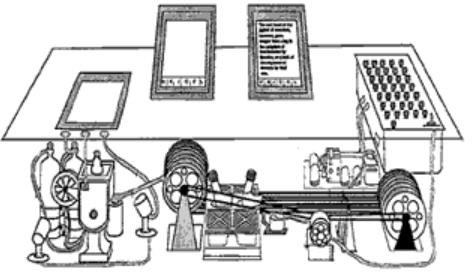

## Evolución histórica de las interfaces

### Ideas precursoras

#### Concepto de Memex

En 1930, Vannevar Bush imaginó el Memex,un dispositivo con pantallas gráficas,teclado y escáner para almacenar yacceder a información mediante enlaces no lineales, anticipando el **hipertexto**.

Sus ideas no fueron aplicadas, porque hasta 1937 no se desarrollarían los primeros ordenadores digitales. 

En 1945 Bush revisó sus ideas en el artículo **"As We May Think"**, e inspiró a Douglas Englebart para intentar construir un dispositivo similar.

```note
Se imagina un sistema para almacenar y relacionar información de forma no lineal.
```

#### The Mother of all demos

En **1968**, Englebart consigue realizar una demostración pública de su proyecto ante un millar de profesionales denominado oN-LINE SYSTEM (*NLS*) y un equipo compuesto de:
- Una pantalla basada en gráficos vectoriales, que puede mostrar texto (sólo mayúsculas) y líneas sólidas.
- Un teclado estándar.
- Una caja con tres botones: el primer ratón de la historia.

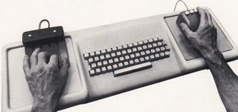

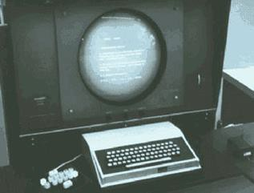

Su demostración incluía hiperenlaces, edición de documentos a pantalla completa, ayuda contextual, trabajo en red, e-mail, mensajería instantánea y videoconferencia. La interfaz se componía de varias ventanas.


El equipo de Englebart abandonó su actividad en 1969 debido a la falta de fondos y pasó a trabajar para una empresa hasta entonces dedicada a la impresión en papel, **Xerox**, que fundó el **Palo Alto Research Center** (*PARC*), en 1970.

El **PARC** ofrecía total libertad para trabajar en el desarrollo de un proyecto de 5 años.


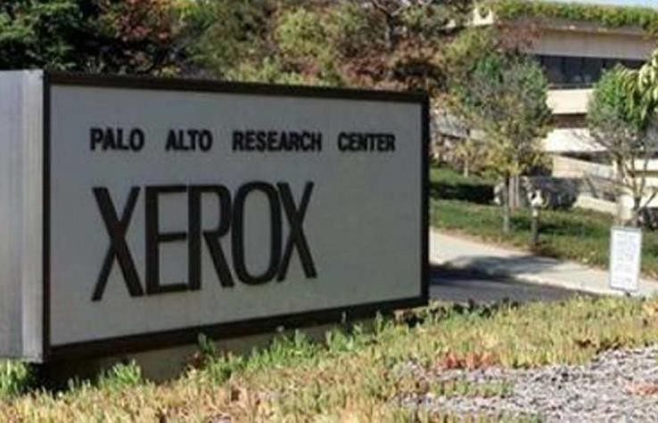

### Nacimiento de la GUI

#### Xerox Alto

PARC presenta en 1973 el primer ordenador con interfaz gráfica: el **Alto**, con una resolución de pantalla de 606 × 808 píxeles.  

Incluye un ratón con tres botones, y un cursor en pantalla con el mismo aspecto que el actual (puntero de flecha en diagonal), y modal, aunque sin ventanas.

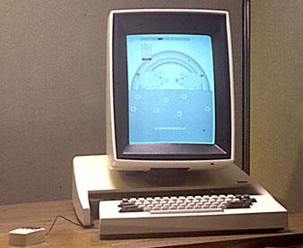

Aunque innovador, Alto no triunfó debido a su falta de uniformidad y alto costo. Sin embargo, sentó las bases para futuros sistemas de interfaz gráfica.

Es el primer equipo de la historia en que se utiliza la interacción o paradigmaconocido como **WIMP** (Windows, icons, Menusand pointers), usada posteriormente por todas las interfaces modernas.


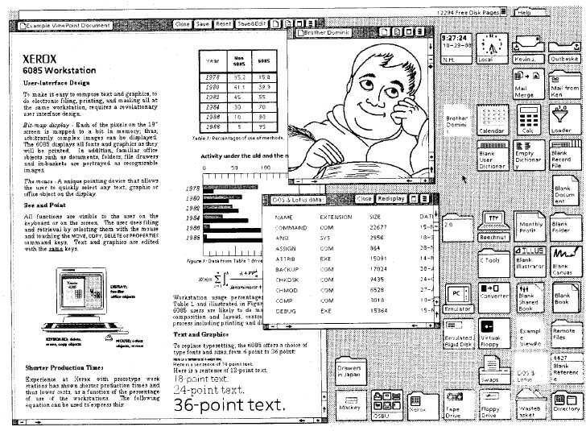

#### Smalltalk

Fruto del esfuerzo en poder trabajar con un equipo intuitivamente y el lema de **WYSIWYG** (*What You See Is What You Get*) se empieza un nuevo Proyecto.

Para proporcionar coherencia a las aplicaciones, el PARC desarrolla en 1974 el primer GUI (interfaz gráfica de usuario) llamado **Smalltalk**.

Smalltalk es la primera interfaz que incluye iconos, barras de desplazamiento (*scrolls*), botones radiales y ventanas de diálogo así como menús pop-up y ventanas superpuestas.

```note
El usuario deja de escribir únicamente comandos y empieza a actuar sobre objetos visibles de una interfaz gráfica.
```

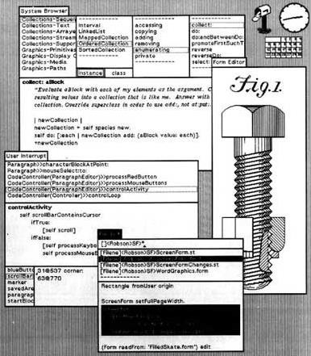

### Xerox Star

En 1981 Xerox presenta la estación de trabajo **Xerox Star**, conocida oficialmente como *8010 Star Information System.*

Fue una revolución al ser el primer sistema comercial en incorporar la interfaz recién creada conocida como Smalltalk manejada por ratón y teclado. 

Xerox Star consolida la metáfora del escritorio: los elementos digitales se representan mediante objetos familiares del mundo real.

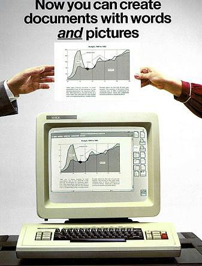

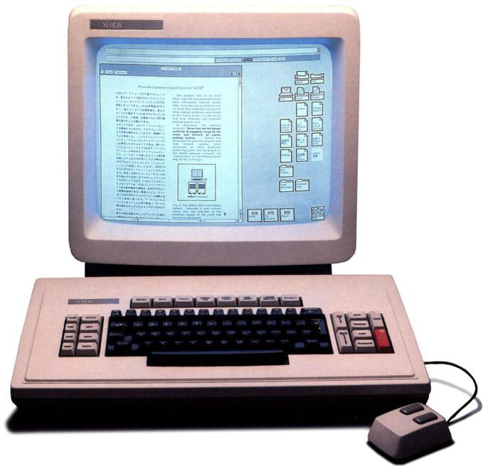

- El software desarrollado para el Xerox Star planteó un duro desafío al equipo encargado de proyectar el hardware, ya que las interfaces gráficas eran muy exigentes en los requerimientos de dicho hardware.
- El 8010 Star Information System se vendía en 16 mil dólares, aproximadamente el triple de lo que costaba un IBM-PC recién lanzado al mercado.
- Las aplicaciones del Star además se programaron con un nuevo lenguaje de programación orientado a objetos llamado **Mesa**, del que más tarde se basarían **Modula-2** y **Modula-3**.
- Xerox Star no fue un éxito de ventas. Los motivos fueron varios, pero quizás los más importantes hayan sido su precio y la falta de experiencia de Xerox como proveedor de equipos informáticos.

#### Apple Lisa (1983)

Algunos de los ingenieros de Xerox desembarcan en otras empresas, entre ellas la fundada en 1976 por Steve Jobs y Steve Wozniak, **Apple Computer**, donde prosiguen las investigaciones iniciadas con Alto y Smalltalk. 

Posteriormente en 1983 se presentaría a **Lisa**, el segundo ordenador de la historia con interfaz gráfica de usuario, con las siguientes características:

- SO multitarea cooperativo.
- Pantalla monocromo de 17’’, 384Kb de RAM.
- Interfaz icónica: cada icono es un documento o aplicación.
- Una barra de menús desplegables.
- Atajos de teclado y papelera para eliminar ficheros.
- Ratón de dos botones acción de doble-clic para seleccionar/ejecutar una aplicación.

#### Apple Macintosh (1984)

Las ventas de Lisa no fueron las previstas, en parte por su elevado precio, su falta de control a los programadores, y la feroz competencia de los inferiores técnicamente pero flexibles IBM-PCs.

Apple desarrolla y lanza en 1984 el primer Macintosh, de precio mucho más reducido (6000\$), una campaña de marketing brutal y características técnicas más limitadas (SO no multitarea, pantalla monocroma y 128kb de memoria) con relativo éxito.

```note
La interfaz gráfica comienza a salir de los centros de investigación y llegar al usuario doméstico.
```

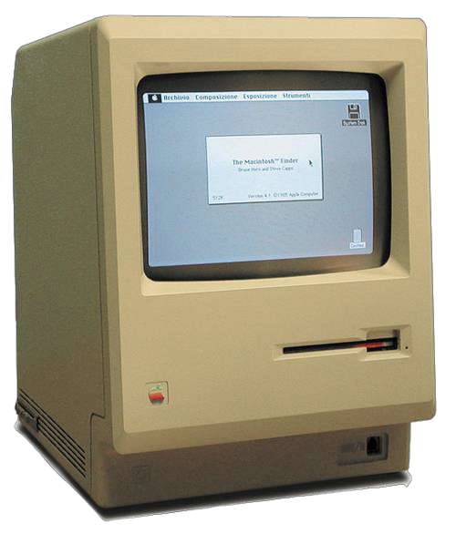

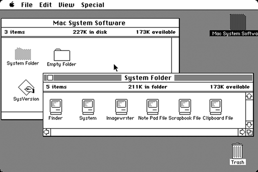


#### Windows

Microsoft, la compañía desarrolladora de Windows, fue fundada en 1975 por William Henry Gates y Paul Allen. Su empresa instala MS-DOS en los IBM-PC sin interfaz gráfica. Para suplir esas limitaciones en 1985 Bill anuncia Windows 1.0.

Windows estuvo limitada a causa de los recursos legales de Apple, que no permitió imitaciones de sus interfaces de usuario.

Sus principales características fueron:

- Interfaz en color.
- Todos los estándares GUI: barras de desplazamiento , elementos de control de ventanas, menús, barra de menú general.
- Ventanas en mosaico (no superpuestas).
- Aplicaciones como el administrador de archivos, calculadora, calendario o la terminal.

```note
La GUI se convierte en el modelo dominante de interacción con el ordenador personal.
```

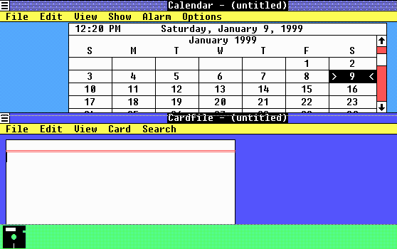


En 1992 se presenta Windows 3.1, el cual incluye fuentes TrueType, elementos multimedia y cuadros de diálogo.

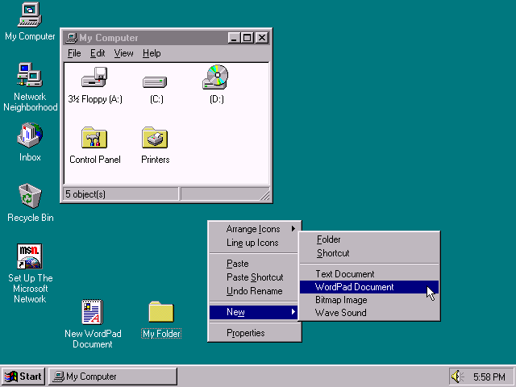

Con Windows 95 se introduce por primera vez el menú de inicio y la barra de tareas, que perdurarán hasta nuestros días en entornos de escritorio.

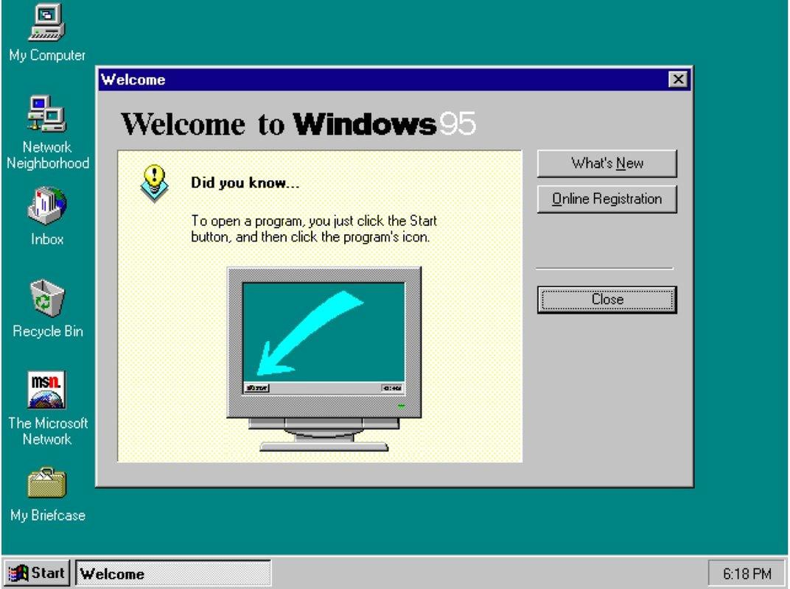

#### X Windows System

A finales de la década de 1990, hubo un crecimiento significativo en el mundo Unix, especialmente entre la comunidad de software libre y la aparición de **Linux**.

Surgieron nuevos movimientos gráficos de escritorio alrededor de Linux y sistemas operativos similares, basados en el sistema **X Window**. Se buscó con moderado éxito proporcionar una interfaz integrada y uniforme al usuario a pesar de la gran variedad de distribuciones. Aparecen entornos de escritorio, como KDE, GNOME y Xfce.

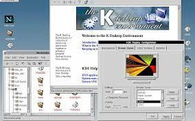

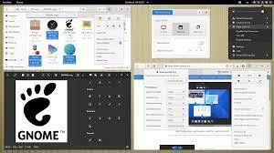

#### Mac OS

En 2001 Apple presenta la interfaz **Aqua** para su Mac OS X, desarrollado en colaboración con NeXT. Aqua incorpora a Exposé que es una característica de Mac OS X que facilita el modo de gestionar las ventanas abiertas, exponiéndolas todas en un mosaico de miniaturas.

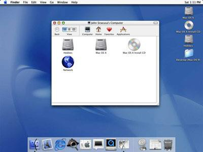

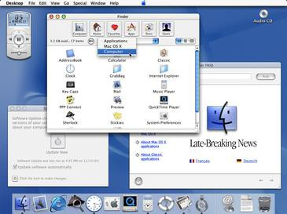

### Web

#### Hipertexto y navegadores web

En 1989, Tim Berners-Lee propone en el CERN un sistema de información basado en hipertexto.
En 1990 desarrolla los componentes fundamentales de la Web:

- documentos HTML
- direcciones URL
- comunicación HTTP
- un primer navegador/editor

En 1993, Mosaic contribuye a popularizar la navegación gráfica por la Web.

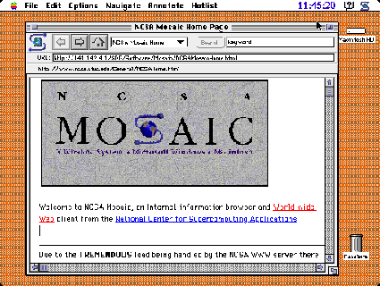

```note
La GUI ya no vive únicamente en aplicaciones instaladas: también empieza a construirse dentro del navegador.
```

#### Evolución de las interfaces web

En 1992, con la aparición de los navegadores, el diseño mediante tablas fue una revolución en cuanto a la organización de los elementos y la experiencia ofrecida a los usuarios. 

Pocos años después, en 1994, se conformó el *World Wide Web Consortium* (W3C) con el fin de desarrollar estándares y recomendaciones web. Aparece **CSS** para presentación y diseño.

A mediados de los noventa, Flash y Javascript dieron lugar a las animaciones con efectos visuales, haciendo posible resolver las limitaciones del HTML. A partir de ese momento, el problema era la larga espera que experimentaban los navegantes cuando cargaban páginas sobrecargadas de complementos.

### Multitáctil / post-WIMP

#### General Magic

Se considera a **General Magic**, la compañía madre de todas las GUI de teléfonos inteligentes modernos. A Marc Porat, que a principios de los 90 trabajaba en Apple, se le ocurrió una idea revolucionaria: la de que era posible crear un dispositivo de comunicación y computación portátil. Con esa idea en mente fundo General Magic, que se adelantó 15 años a la época, y sentó las bases del futuro iPhone.

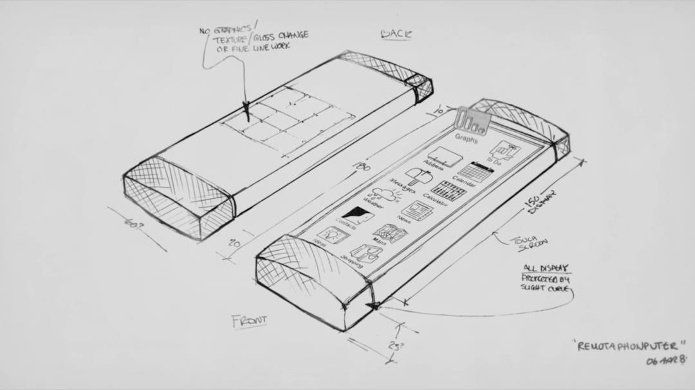

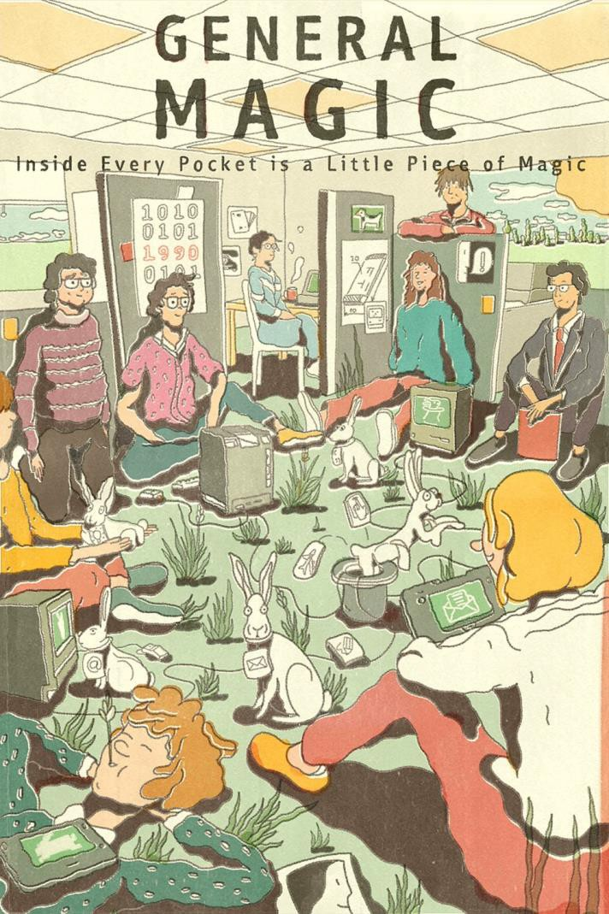

#### La información se hace móvil

En el equipo de General Magic, hubo empleados muy exitosos como la directora de tecnología de la Casa Blanca (Megan Smith), el co-creador de Android (Andy Rubin), el fundador de eBay (Pierre Omidyar) o el codiseñador del iPod y iPhone (Tony Fadell).

Con el surgimiento de la World Wide Web, se lanza su primer producto serio, el **Apple Newton**, de apariencia similar, un PDA (asistente digital personal) con sistema operativo Newton OS, y reconocimiento de escritura pero que no triunfó.

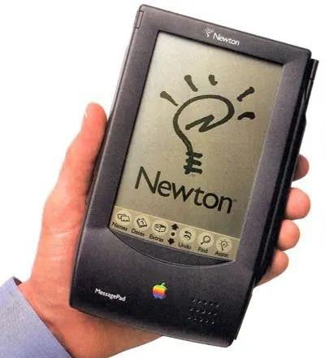

#### Interacción multitáctil

A principios del siglo XXI, dos nombres, Apple y Google, entraron oficialmente en la carrera para convertirse en los sistemas operativos mejor calificados, aunque dicha carrera fue iniciado por Apple y su iPhone como luego veremos. No obstante hubo otros competidores como Symbian, Blackberry o Windows Phone que no lograron tener éxito.

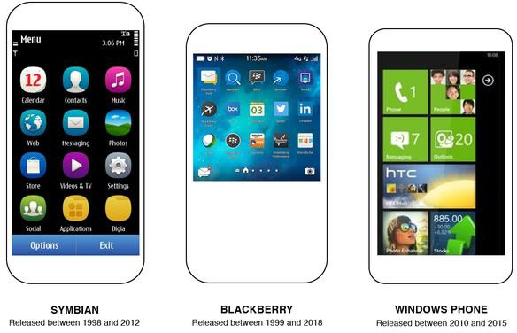

#### Dispositivos móviles Apple

En 2007 surge el **iPhone** y más tarde en con la introducción del iPad, Apple popularizó el estilo de interacción **post-WIMP** para pantallas multitáctiles.

Con el primer iPhone Steve Job presentó una interfaz de usuario basada en tecnología de pantalla táctil; fue el primer móvil en no tener teclado físico, cambiando la interacción humana sobre productos digitales que había hasta entonces..

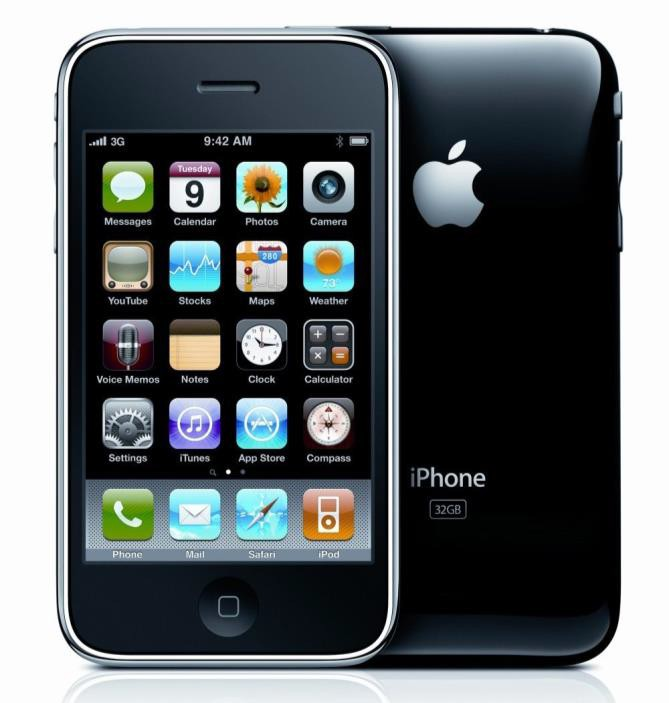


La interfaz de usuario del iPhone tenía un estilo *esqueuomórfico* completo. Ello significa que las funciones de la interfaz de usuario se diseñaron para parecerse a elementos de la vida real.

Se agregaron degradados, sombras paralelas y bordes a los botones para que parezcan 3D y se pueda hacer clic en ellos.

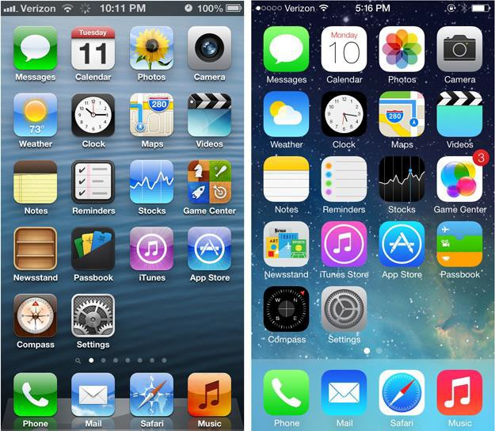

Desde 2007 dicho estilo ha sido sustituido por un nuevo estilo denominado diseño plano (*flat design*) que acertadamente introdujo la competencia del iPhone, los SO basados en su competidor Android de Google.

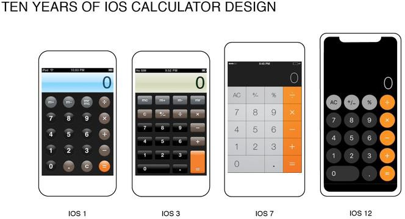 


### Dispositivos móviles Android

Android fue lanzado en 2007 y su primera versión en septiembre de 2008. Desde su comienzo, Android ha sido altamente personalizable. Poco después, antes del lanzamiento del primer teléfono Android, esta filosofía cambió para convertirse en eminentemente táctil, y poder competir contra el iPhone, presentado un año antes. Desde entonces, Android ha pasado por múltiples lanzamientos y una madurez que tampoco tiene que envidiar al SO móvil de Apple.


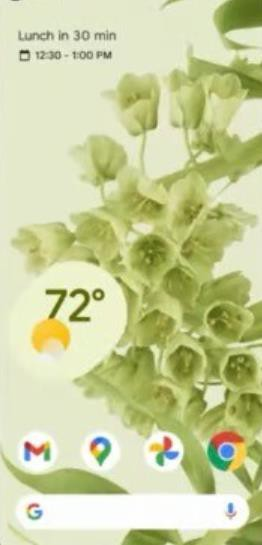

Un hito del GUI de Android fue **Material Design**, anunciado en 2014, junto con el lanzamiento de la versión 5.0 de Android Lollipop. Desde entonces se ha ido implementando en cada una de sus aplicaciones para crear un sistema que ofrezca la misma experiencia de usuario en todas las plataformas y dispositivos. Matías Duarte, diseñador de interfaces y vicepresidente de diseño de Google, es uno de los impulsores de este sistema de diseño que ha transformado la IU y UX del entorno web y móvil en la actualidad. En 2021 Material design ha evolucionado a **Material You**.

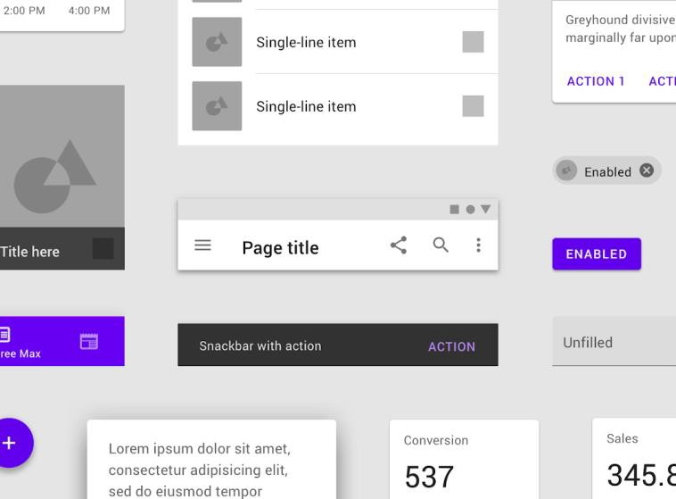


#### Escritorios clásicos integrados

**Microsoft** ha continuado evolucionando Windows como sistema operativo de escritorio, manteniendo el paradigma. Windows 11 representa su generación actual, con un sistema de integración parcial con teléfonos Android e iOS.

**Apple** ha evolucionado macOS como sistema operativo de escritorio, integrándolo progresivamente con el resto de su ecosistema. Actualmente, Mac, iPhone y iPad comparten servicios, aplicaciones y formas de interacción, facilitando la **continuidad** entre dispositivos.


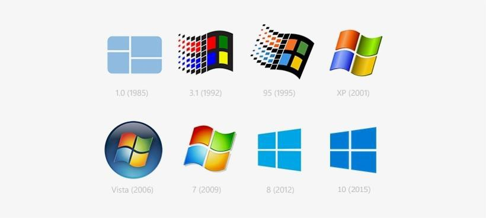

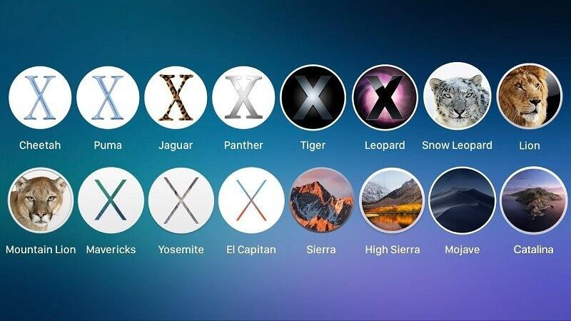

 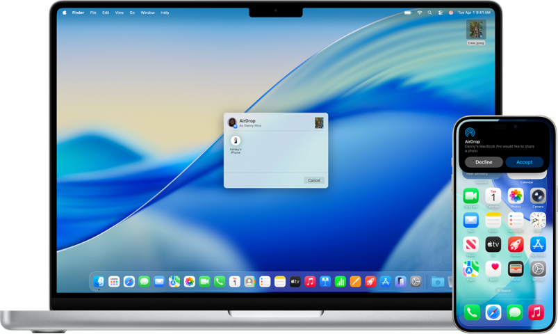

### Interfaces naturales

Las interfaces naturales comunicarse con el usuario usando para ello medios como la voz, los gestos o la mirada.  El lanzamiento del iPhone en 2007, con su interfaz multitáctil, y la introducción de Kinect o Nintendo Wii que permitía la interacción mediante gestos, marcaron hitos importantes en el desarrollo de estas interfaces.

En la actualidad existen desarrollos en realidad aumentada (**AR**) y  realidad virtual (**VR**), donde los usuarios interactúan con entornos digitales mediante movimientos corporales y comandos de voz. Los asistentes virtuales y de OA han llevado el **reconocimiento de voz** a millones de personas.

```note
La interacción se acerca progresivamente a las capacidades naturales del usuario.
```

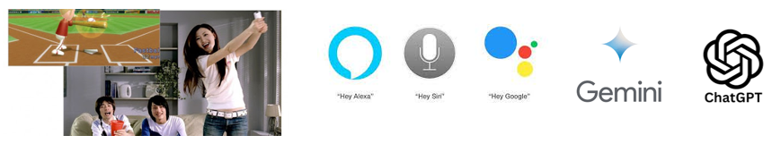 

### Interfaces espaciales + IA

La realidad aumentada, virtual y mixta permiten situar contenido digital en un entorno tridimensional mediante **interfaces espaciales**.

La interacción puede combinar:
- Mirada
-  Manos y gestos
-  Voz
-  Posición y espacio

Gafas como Meta Quest o las Apple Vision Pro.

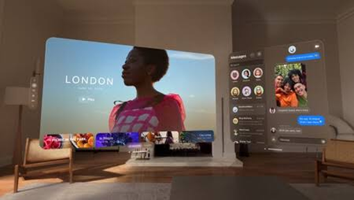 

Las **interfaces basadas en IA** permiten que el usuario no tenga que conocer necesariamente qué opción o comando debe utilizar.

En lugar de seleccionar una función concreta:
*Usuario → menú → opción → comando*
puede expresar directamente su intención:
*Usuario → “quiero conseguir esto” → sistema interpreta la intención*

La interacción puede combinar:
- Texto 
- Voz
- Visión
- Interfaz gráfica

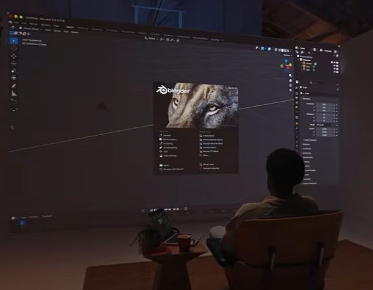 


## UI y UX

```note
💡 **UI** (*User Interface*) se corresponde con el diseño visual de una interfaz de usuario.
```

UI se refiere al conjunto de elementos visuales e interactivos que permiten al usuario comunicarse con el sistema: botones, menús, tipografías, colores, iconos, formularios… En otras palabras, es 'lo que el usuario ve y toca'.


```note
💡 **UX** (*User Experience*) hace referencia a las sensaciones de utilizar una interfaz de usuario que experimenta una persona al utilizarla.
```

No sirve de nada tener un producto bonito si no satisface las necesidades de los usuarios para los que está pensado. Es por ello que el diseño UX busca resolver las necesidades de los usuarios finales buscando la experiencia de uso.

### Caso práctico

- **Elementos de UI**

    En una app bancaria, la UI incluye colores de la marca, tipografías legibles, tamaño de botones y ubicación del menú. Estos elementos guían la atención visual y comunican la identidad de la marca.

- **Elementos de la UX**

    Sin embargo, una interfaz atractiva no garantiza que el usuario comprenda el proceso ni se sienta seguro al realizar operaciones críticas. La UX es la facilidad con la que el usuario puede consultar su saldo, transferir dinero sin errores y sentirse seguro al hacerlo.

Dentro de las actividades que se realizan en **UI**, están:

- Diseño de interacción (cómo responde el sistema)
- Guías de interacción (estados del sistema)
- Diseño de elementos (botones, formularios)
- Diseño visual (iconos, imágenes)
- Guías de estilo (paletas de color, fonts)

Dentro de las actividades del **UX** están las siguientes:

- Conocer a fondo a los usuarios finales, realizando una investigación correspondiente.
- Diseñar un producto que resuelva sus necesidades y se ajuste a las necesidades de tu organización y usuario.

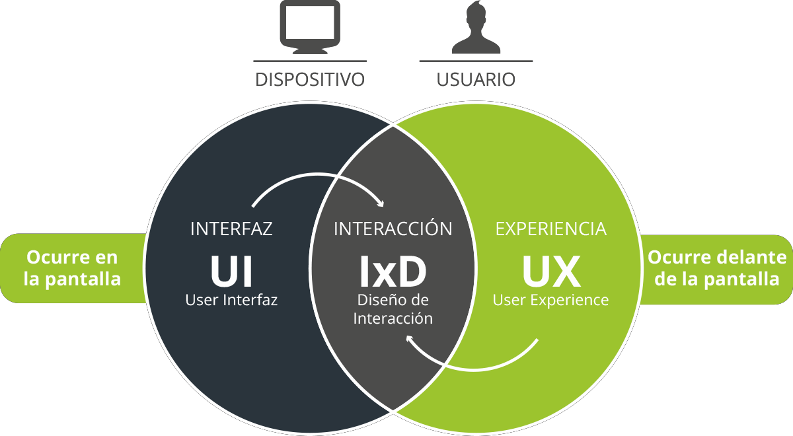

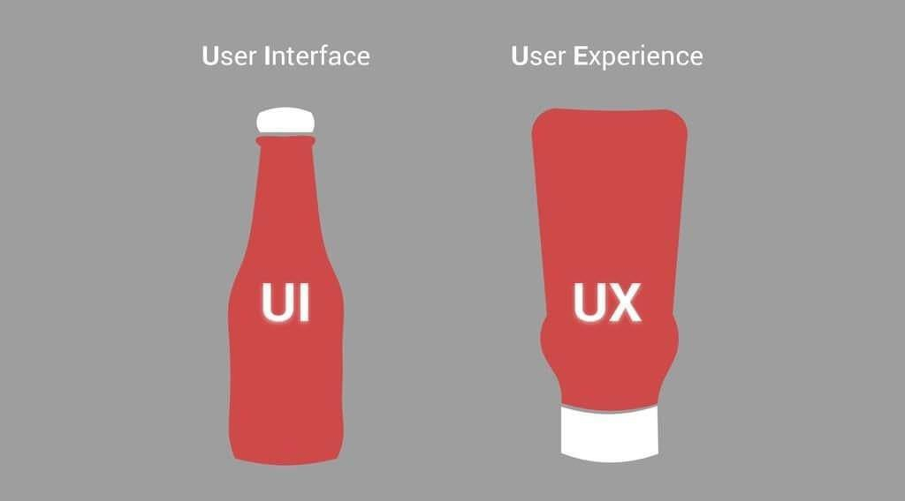

