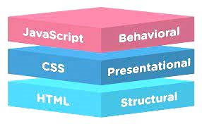
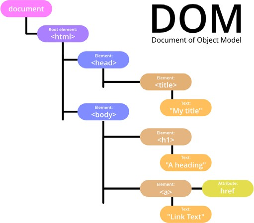

# UT5.5 Introducción a Javascript

## Introducción a Javascript

```note
**Javascript** es un lenguaje de programación de scripts ligero y orientado a objetos, diseñado en un principio para añadir interactividad a las páginas webs y crear aplicaciones web.
```

Javascript es la última capa de funcionalidad en los sitios web interactivos; la capa de contenido la forma el HTML, el diseño el CSS, mientras que la interactividad Javascript.



Hoy en día, JavaScript cuenta con multitud de frameworks y librerías para simplificar proyectos complejos, como **AngularJS**, **jQuery** y **ReactJS**.

Aunque originalmente se ejecutaba en el lado del cliente, la implementación de JavaScript se ha extendido al lado del servidor tras el desarrollo de **Node.js**, un entorno de servidor multiplataforma construido sobre el motor V8 de JavaScript de Google Chrome.

### Java vs Javascript

Java y JavaScript no están relacionados, a pesar de compartir el término «Java». Sin embargo, tienen claras diferencias, entre ellas:

-   Programación orientada a objetos: Java es un lenguaje de programación orientado a objetos. JavaScript es un lenguaje de programación de scripts orientado a objetos.
-   Sintaxis: La sintaxis de JavaScript no es tan formal o estructurada como la de Java. Por lo tanto, es más sencilla para la mayoría de los usuarios.
-   Compilación: Java es un lenguaje compilado, mientras que JavaScript es un lenguaje interpretado que se interpreta línea por línea en tiempo de ejecución; los lenguajes compilados suelen ser más rápidos, pero los interpretados suelen ser más flexibles.
-   Entorno: Las aplicaciones Java se pueden utilizar básicamente en cualquier entorno, ejecutándose en máquinas virtuales o en navegadores; JavaScript es solo para navegadores.
-   Uso de memoria: Java consume más memoria que JavaScript, por lo que este último es preferible para las páginas y aplicaciones web.

El núcleo del lenguaje JavaScript de lado del cliente consta de algunas características de programación comunes que permiten hacer cosas como:

-   Almacenar valores útiles dentro de variables. Por ejemplo, pedir que se ingrese un nombre y almacenarlo en una variable llamada *name*.
-   Operaciones sobre fragmentos de texto (Strings). Cortar y pegar la información de distintos formularios web para hacer una petición al servidor.
-   Ejecutar código en respuesta a ciertos eventos que ocurren en una página web. Usar el evento clic para detectar cuándo se hace clic en el botón y luego ejecutar el código que actualiza una etiqueta de texto.

Lo más interesante de Javascript es la posibilidad de utilizar diversas **API** que proporcionan funcionales muy interesantes para utilizar en el código JavaScript. Existen dos tipos de API, del navegador y externas, las cuales veremos más adelante.


## Características de Javascript

### Ubicación del código Javascript

El código en Javascript se puede indicar con la etiqueta \<script\> en el mismo código HTML, pero lo habitual es incluirlo en un fichero externo usando el siguiente formato:

```html
<script src="fichero.js"></script>
```

La ubicación de la etiqueta script con nuestro script es importante ya que tiene distinto efecto sobre la interacción en ésta:

| **Ubicación**      | **Ejecución del archivo Javascript**      | **Estado de la página**                           |
|--------------------|-------------------------------------------|---------------------------------------------------|
| En \<head\>        | **ANTES** de empezar a dibujar la página. | Página aún no dibujada.                           |
| En \<body\>        | **DURANTE** el dibujado de la página.     | Dibujada hasta donde está la etiqueta \<script\>. |
| Antes de \</body\> | **DESPUÉS** de dibujar la página.         | Dibujada al 100%.                                 |

### Tipos de datos

```note
En JavaScript todo es un **objeto** y puede ser almacenado en una variable.
```
Disponemos de los siguientes **tipos de datos** principales:

| **Tipo de dato** | **Descripción**                                       | **Ejemplo básico**   |
|------------------|-------------------------------------------------------|----------------------|
| Number           | Valor numérico (enteros, decimales, etc...)           | 42                   |
| BigInt           | Valor numérico grande                                 | 1234567890123456789n |
| String           | Valor de texto (cadenas de texto, carácteres, etc...) | 'MZ'                 |
| Boolean          | Valor booleano (valores verdadero o falso)            | true                 |
| undefined        | Valor sin definir (variable sin inicializar)          | undefined            |
| Function         | Función (función guardada en una variable)            | function() {}        |
| Symbol           | Símbolo (valor único)                                 | Symbol(1)            |
| Object           | Objeto (estructura más compleja)                      | {}                   |

Las variables se pueden definir mediante la palabra clave *var* o *let*:

```javascript
var text = "Hola, me llamo Javier"; 
let number = 42;
```

### Condicionales

La forma de condicional más común en Javascript, como en la mayoría de lenguajes, es el if... else.

Así, por ejemplo:

```javascript
let helado = "chocolate"; 
if (helado === "chocolate") { 
	alert("Me gusta el helado de chocolate"); 
} else { 
alert("No es helado de chocolate pero esta bien");
} 
```

### Bucles

**Bucle for**

```javascript
for (let i = 0; i < 5; i++) { 
    console.log(i); 
}
```

**Bucle for in**

```javascript
const obj = { a: 1, b: 2, c: 3 }; // initiating a a const object 

for (let key in obj) { 
console.log(`${key}: ${obj[key]}`); 
} 
```

**Bucle for each**

```javascript
miArray.forEach(function (value) { 
console.log(value); 
});
```

**Bucle while**

```javascript
while (i < 5) { 
console.log(i); 
i++; 
}
```

**Bucle do while**

```javascript
var i = 0; 
do { 
i = i + 1; 
console.log(i); 
} 
while (i < 5); 
```

### Funciones

En Javascript, las funciones son uno de los tipos de datos más importantes, ya que se utilizan continuamente. Además se pueden considerar también como un tipo de datos.

Existen los siguientes tipos de funciones, según las definamos:

| **Constructor**                      | **Descripción**                            |
|--------------------------------------|--------------------------------------------|
| function nombre(p1, p2...) { }       | Crea una función mediante **declaración**. |
| var nombre = function(p1, p2...) { } | Crea una función mediante **expresión**.   |

En las funciones por expresión los programadores *guardan funciones* dentro de variables, para posteriormente *ejecutar dichas variables.* Por ejemplo:

```javascript
const saludo = function saludar() {
 return "Hola"; 
}; 
…
saludo(); // 'Hola'
```

### El árbol DOM

El **DOM** (*Document of Object Model*) de una web es la estructura del documento HTML. Una página HTML está formada por múltiples etiquetas HTML, anidadas una dentro de otra, formando un árbol de etiquetas relacionadas entre sí.



En Javascript, la forma de acceder al DOM es a través de un objeto llamado document, que representa el árbol DOM de la página.

En su interior pueden existir varios tipos de elementos, pero principalmente serán:

- **element**: representación genérica de una etiqueta: *HTMLElement*.
- **node**: es una unidad más básica, la cuál puede ser un *element* o un nodo de texto.

Javascript permite acceder a los elementos del DOM para recuperar su información, agregar nueva o modificarlos, haciendo uso para ello de varias interfaces de su API.

Veremos para ellos los métodos más usados según su uso:

**Búsqueda de elementos HTML**

| **Método**                           | **Descripción**                             |
|--------------------------------------|---------------------------------------------|
| document.getElementById(id)          | Buscar a un elemento HTML mediante su id    |
| element.getElementsByClassName(name) | Buscar a un elemento HTML mediante su clase |

Así por ejemplo para recuperar en una variable la información del elemento que tiene por id *demo*:

```javascript
<body> 
<h2>Mi primera página</h2> 
<p id="demo">Hola</p> 
<script> var elem = document.getElementById; </script> 
</body> 
```

**Modificar elementos HTML**

| **Método**                               | **Descripción**                                  |
|------------------------------------------|--------------------------------------------------|
| element.innerHTML = nuevo contenido html | Modifica el HTML interno del elemento            |
| element.attribute = nuevo valor          | Modifica el valor del atributo del elemento HTML |
| element.style.property = new style       | Modifica el valor del estilo del elemento HTML   |

**Agregar o eliminar elementos**

| **Método**                      | **Descripción**           |
|---------------------------------|---------------------------|
| document.createElement(element) | Crear un elemento HTML    |
| document.removeChild(element)   | Eliminar un elemento HTML |
| document.appendChild(element)   | Agregar un elemento HTML  |

### Eventos

A la hora de navegar por una página, el usuario genera **eventos** que son capturados por JavaScript. Algunos de dichos eventos pueden ser los siguientes:

-   Click de ratón del usuario sobre un elemento de la página
-   Pulsación de una tecla específica del teclado
-   Reproducción de un archivo de audio/video
-   Scroll de ratón sobre un elemento de la página
-   Se envía un formulario

Un evento de JavaScript por sí mismo carece de utilidad. Para que los eventos resulten útiles, se deben asociar funciones o código JavaScript a cada evento. El ejemplo más obvio es un clic (*onclick*), que se activa al hacer clic sobre algo.

```javascript
document.querySelector("html").onclick = function () { 
 alert("has hecho clic en mi"); 
};
```

A continuación, otro ejemplo en el que se utiliza *addEventListener* para hacer que al hacer clic sobre un botón se imprima un mensaje por la consola de JavaScript:

```html
<input id="boton" type="button" value="Aprétame"> 

<script> 
// Capturamos el boton 
const boton = document.querySelector('#boton’); 

// Escuchamos, del boton, el evento 'click’ y ejecutaremos la función 

boton.addEventListener('click', function(evento) { 
   console.log('funciono'); }, false);</script>
```
